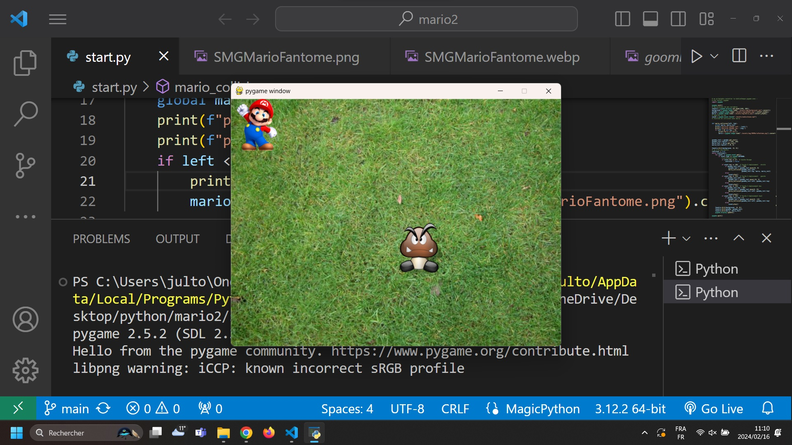

# Pygame project for educative python learning

- how to use def
- conditions
- scope and global vars
- while


## Screenshots




## Deployment

To use pygame library :

```bash
  pip install pygame
```

